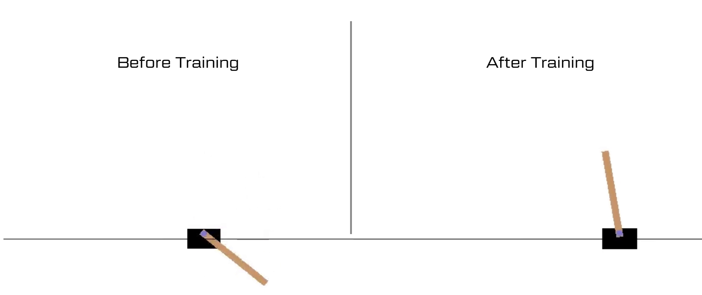
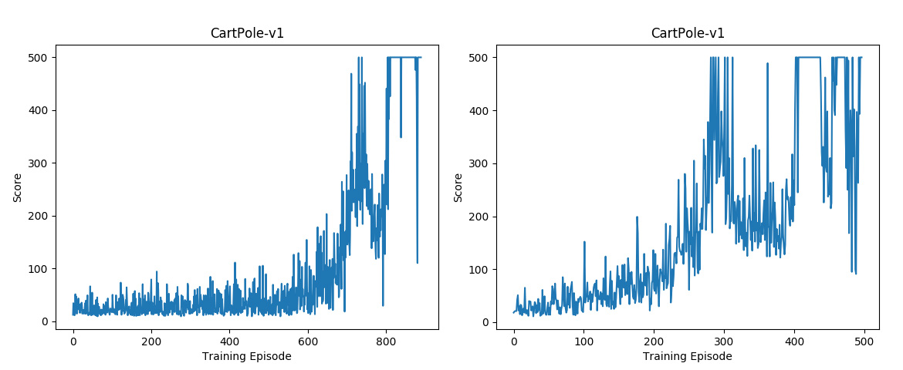

# CS234 Stanford Reinforcement Learning Course (2019)
CS234 Course Assignments from Stanford about Reinforcement Learning. Only coding section will be contained in this repository.
Theoretical questions will be available on request only (hard task to do in Latex).

All codes were developed in TF 1.14 due to I was not able to change the version in a remote computer. So, many warnings appeared in terminal ipython =/

### Assignment1
Using the Frozen Lake MDP (4x4) environment from OpenAI Gym, I implemented the following algorihtms for the deterministic and stochastic environments:
- policy_evaluation, policy_improvement and policy_iteration
- value_iteration

### Assignment2:
Using a 5x5 map and a Pong Atari game from OpenAI Gym, I implemented (and evaluated on this atari environment) the following algorithms:
- Linear approximation: All functions related to compute and obtain information from Q, loss function and gradient computation.
    add_placeholders, get_q_values, add_update_target, add_loss, add_optimizer
- Deep Q-Network: network architecture (3 conv layers and 2 dense layers) and its learning process.
    get_q_values
- Train the Linear approximation and DQN in the Pong environment fitting some hyperparameters.
- Alternatively, I trained another scenario to test the robustness of DQN, and if it follows the original paper: Boxing -v0, Breakout-v0, Pong-v0, MSPacMan-v0

- Respective scores.

### Assignment3:
Using CartPole-v1, InvertedPendulum-v1 and HalfCheetah-v1 from OpenAI Gym, I implemented (and evaluated on these environments) the following algorithms:
-  Policy Gradient Methods with REINFORCE, baseline and Advantage Normalization.
    build_mlp, add_placeholders build_policy_network, add_loss, add_optimizer, add_baseline, get_returns , calculate_advantage , update_baseline
- Policy gradient methods were trained on CartPole-v1, and Pendulum was manully added by instantiation a new environment in OpenAI Gym.
- I had some problems to save videos when Mujoco was being used, so I only saved the video using CartPole-v1.
- Policy gradient was used in this problem, also baselines and advantages functions.

- Scores of neural networks using baseline and without baseline, respectively.

## Acknowledgement:
- Thanks to Federal University of Rio de Janeiro (UFRJ) which helped me with the infrastructure and motivation to do this course.
